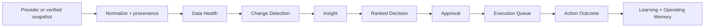

# AI COO OS — Phase 2 Source of Truth

Last updated: 2026-08-14

## Purpose

The system turns verified operating evidence into a small number of decisions across five WonderElian products. The primary outcome is attributable first-time App Store downloads. Style Atlas is the first fully instrumented app; missing portfolio data remains `null`.

## Operating loop

## Ingestion and provenance

Every metric stores `app_id`, `metric`, `value`, period, source, provider, source reference, imported and verified timestamps, freshness, confidence, and notes. The normalized provider boundary supports acquisition, revenue, content, and feedback data. The first real path is a verified manual App Store snapshot; no live API credentials are configured.

Ingestion is idempotent on app, metric, period, provider, and source reference. Re-importing the same snapshot records it as unchanged rather than duplicating the observation.

## Data Health

Per-app Data Health reports providers, last successful import, stale sources, missing critical metrics, import errors, and attribution coverage. Recommendation confidence is capped when evidence is incomplete. A zero Data Health score means zero verified coverage; it is not a product-performance metric.

Current Style Atlas coverage:

- 6 verified App Store metric records;
- 15 permanent published URLs;
- 3 complete content-to-landing-to-App-Store campaign paths;
- no verified content-level first-time-download result yet.

## Detection and decisions

The change engine compares like-for-like metrics from the same app, provider, and unit. It requires two observations, minimum absolute and percentage change, and a sufficient sample. One snapshot cannot create a trend.

Only material metric detections become Insights. Each Insight keeps observation, evidence, interpretation, and recommendation separate. Decisions use an inspectable score:

- expected impact 25%;
- confidence 20%;
- urgency 15%;
- low-effort advantage 10%;
- reversibility 10%;
- strategic relevance 10%;
- evidence quality 10%.

The score is a ranking aid, not statistical certainty.

## Risk, approval, and execution

| Level | Meaning | Automatic behavior |
| --- | --- | --- |
| 0 | Read-only | May execute automatically |
| 1 | Internal reversible | May execute automatically |
| 2 | External reversible | Approval required before execution |
| 3 | High consequence | Explicit approval always required |

Approved work enters the Execution Queue: `waiting -> ready -> executing -> completed`, with blocked, failed, cancelled, and retry paths. Level 2/3 completion requires a verified external URL or identifier.

## Measurement and learning

Completed actions receive an `ActionOutcome` with before/after values, period, observed effect, confidence, result, and notes. Inconclusive or unmeasurable results do not create a positive learning. Conclusive outcomes may generate evidence-linked channel, content, conversion, experiment, or product learnings.

Operating Memory stores summarized positioning, channel rules, platform blockers, and brand constraints. It never stores raw chat history, credentials, or browser sessions.

## Scheduler

Eight jobs cover acquisition import, content performance, feedback, anomaly calculation, insight generation, brief refresh, experiment evaluation, and completed-action measurement. The runner is intentionally single-machine. Provider failure is recorded per job and does not fabricate data or stop unrelated jobs.

## Public/private boundary

- Local mode binds to `127.0.0.1`, writes atomically, runs imports and jobs, records approvals, and exposes audit details.
- GitHub Pages is a generated read-only snapshot. Forms and execution controls are hidden.
- The static build removes private-shaped fields and fails if generated data contains emails, local absolute paths, passwords, tokens, cookies, API keys, authorization material, or private keys.

## Current real cycle

The 2026-08-14 Style Atlas cycle read six verified metrics and found no second comparable App Store snapshot. Result: **No material change detected.** It ran a Level 0 internal Data Health and attribution refresh. No external system was changed. Search Console and verified feedback remain missing feeds; the guide-vs-comparison experiment is awaiting verified attribution data.

## Known blockers

- App Store Connect API authentication is not configured; acquisition remains a verified manual snapshot.
- Search Console is not connected.
- Social APIs provide no verified performance imports.
- No verified customer-feedback snapshot is available.
- Campaign-level first-time downloads remain unknown.

## Phase 3 priorities

1. App Store Connect read-only daily and campaign ingestion.
2. Search Console landing/query integration.
3. Verified App Store review ingestion.

